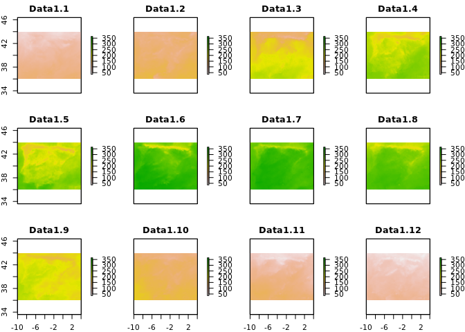

<!-- README.md is generated from README.Rmd. Please edit that file -->

[](https://travis-ci.org/mdsumner/ffraster)
[](https://ci.appveyor.com/project/mdsumner/ffraster)
[](https://codecov.io/github/mdsumner/ffraster?branch=master)

ffraster allows loading a file-backed raster as an `ff` object.

``` r
library(raster)

b <_ brick("/some/huge/brick.grd")

library(ffraster)
ff_object(b)
```

Please see related work in library mmap, in GDAL virtualmem, VRT-linked
binary, GDAL driver for R-raster, R packages ff, spatial.tools, mmap,
bigmemory, rasterfaster, Manifold’s Raw Binary surface, and Radian.

# Applications

Create a brick by instantiating the file with an `ff` “out of memory”
array and populating the data layer by layer using ff’s array methods.

First, obtain the SST data use in `rasterVis::hovmoller`, we end up with
several file paths to NetCDF files in `files`.

``` r
td <- tempdir()
curl::curl_download('https://raw.github.com/oscarperpinan/spacetime-vis/master/data/SISmm2008_CMSAF.zip',
              destfile = file.path(td, 'SISmm2008_CMSAF.zip'))
unzip(file.path(td, 'SISmm2008_CMSAF.zip'), exdir = td)
files <- file.path(td, list.files(td, pattern = "SISmm.*UD.nc$"))
```

Now set up the .grd metadata file and a ff-array as an interface to the
raw binary data in the .gri file.

``` r
library(raster)
#> Loading required package: sp
## we'll create a brick layer by layer in this file (.grd/.gri)
r_brickfile <- rasterTmpFile()
library(dplyr)
#> 
#> Attaching package: 'dplyr'
#> The following objects are masked from 'package:raster':
#> 
#>     intersect, select, union
#> The following objects are masked from 'package:stats':
#> 
#>     filter, lag
#> The following objects are masked from 'package:base':
#> 
#>     intersect, setdiff, setequal, union
## we need the first layer to initiate the target as a template
r0 <- raster(files[1])
#> Loading required namespace: ncdf4

library(ffraster)
ffraster:::.writeGRD(r0, 
                     dataType = "FLT4S", 
                     filename = r_brickfile, 
                     nbands = length(files), 
                     ## if dates are known, input them here for each file
                     dates = NULL)  
#> [1] TRUE

## use mode "single", float32 (or double, float64)
ff_array  <- ffrarr(c(nrow(r0), ncol(r0), 
               length(files)), 
             mode = "single", 
             filename = r_brickfile, 
             readonly = FALSE)

## now loop and populate
for (i in seq_along(files)) {
  ## in the loop we read each layer from file (or whatever source of layers we have)
  r <- raster(files[i])
  ## the ff array can be written to by treating like a slice in a 3D array
  ## the default is transpose, but note other layouts are possible for rasterfile and in ff
  ff_array[,,i] <- values(t(r))
}


plot(brick(r_brickfile), zlim = c(36, 365))
```

<!-- -->

``` r

## show that we get the same result
plot(stack(files), zlim = c(36, 365))
```

<!-- -->

Please note that this project is released with a [Contributor Code of
Conduct](CONDUCT.md). By participating in this project you agree to
abide by its terms.
